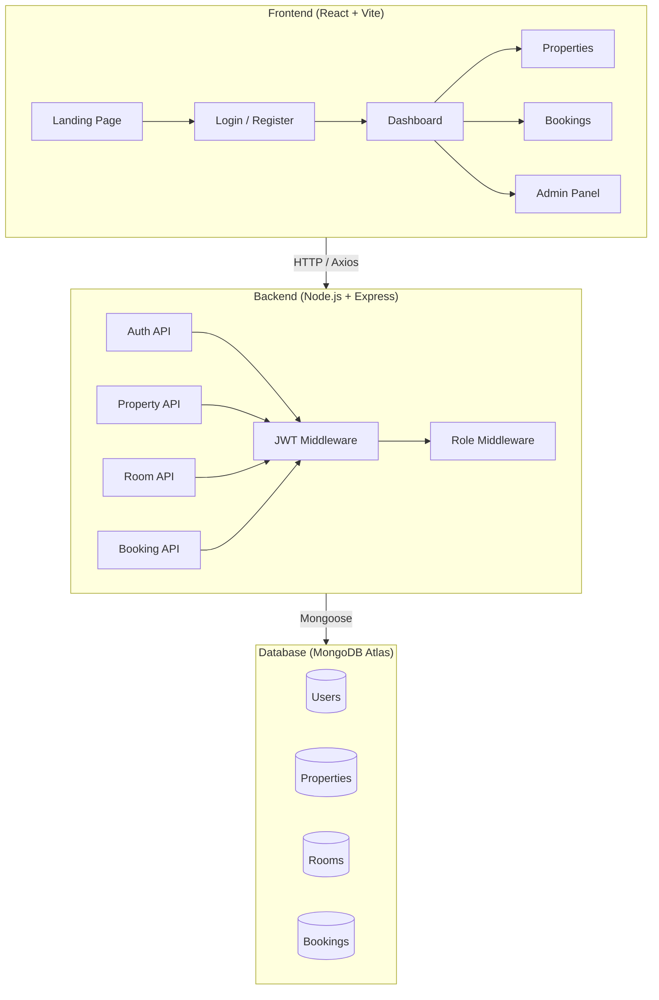

# StaySync — Project Documentation

> **Premium PG & Accommodation Management System**
> Built with the MERN Stack (MongoDB, Express, React, Node.js)

---

## 📌 What is StaySync?

StaySync is a **full-stack web application** designed to help PG (Paying Guest) owners, hostel managers, and accommodation providers digitize and automate their daily operations. It replaces manual registers, WhatsApp-based rent tracking, and paper-based KYC with a sleek, modern, cloud-powered dashboard.

**Think of it as:** An Airbnb-style backend for PG/hostel owners — but focused on **long-term stay management** rather than short-term booking.

---

## 🎯 Problem Statement

Managing a PG or hostel business today involves:
- Tracking rent payments manually (pen & paper or Excel)
- No centralized system for tenant records (KYC, Aadhar, contracts)
- Difficulty managing room availability across multiple properties
- Chasing defaulters via calls/WhatsApp
- Zero financial oversight or reporting

**StaySync solves all of this** with a single, unified platform.

---

## 👥 User Roles

StaySync has a **Role-Based Access Control (RBAC)** system with 3 distinct user types:

| Role | Description | Permissions |
|------|-------------|-------------|
| **Admin** | System-level super user | Full access to all properties, users, reports, admin panel |
| **Owner** | PG/Hostel property owner | Create properties, manage rooms, approve bookings, view revenue |
| **Resident** | A tenant/guest staying at a PG | View their booking, room details, make payments |

> [!IMPORTANT]
> New users who register via the public signup form are **always assigned the `resident` role** by default. This prevents privilege escalation attacks where someone could register as an admin.

---

## 🏗️ Architecture Overview



---

## 📁 Project Structure

```
Demo Website PG/
├── client/                    # Frontend (React + Vite + TailwindCSS)
│   ├── src/
│   │   ├── components/
│   │   │   └── Navbar.jsx          # Global navigation bar
│   │   ├── context/
│   │   │   └── AuthContext.jsx     # Auth state, JWT handling, Axios interceptor
│   │   ├── pages/
│   │   │   ├── Home.jsx            # Landing page with hero, stats, features
│   │   │   ├── Login.jsx           # Split-screen login UI
│   │   │   ├── Register.jsx        # Split-screen registration UI
│   │   │   ├── Dashboard.jsx       # Analytics dashboard (revenue, occupancy)
│   │   │   ├── Properties.jsx      # Property grid with images & badges
│   │   │   └── Bookings.jsx        # Tabbed booking management interface
│   │   ├── App.jsx                 # Router, PrivateRoute, AdminRoute
│   │   ├── main.jsx                # Entry point
│   │   └── index.css               # Tailwind imports + global styles
│   ├── tailwind.config.js
│   ├── postcss.config.js
│   ├── vite.config.js
│   └── package.json
│
├── server/                    # Backend (Node.js + Express)
│   ├── src/
│   │   ├── controllers/
│   │   │   └── authController.js   # Register, Login, GetMe
│   │   ├── middleware/
│   │   │   └── auth.js             # JWT verification + role guard
│   │   ├── models/
│   │   │   ├── User.js             # User schema (name, email, role, KYC)
│   │   │   ├── Property.js         # Property schema (owner, address, amenities)
│   │   │   ├── Room.js             # Room schema (beds, pricing, availability)
│   │   │   └── Booking.js          # Booking schema (rent, deposit, payment status)
│   │   ├── routes/
│   │   │   ├── authRoutes.js       # POST /register, /login, GET /me
│   │   │   ├── propertyRoutes.js   # CRUD for properties
│   │   │   ├── roomRoutes.js       # Add rooms, get rooms by property
│   │   │   └── bookingRoutes.js    # Book a room with pro-rata rent calculation
│   │   └── services/
│   │       └── stripeService.js    # Stripe checkout session creation
│   │   └── app.js                  # Express app config (CORS, body parser, routes)
│   ├── server.js                   # HTTP server, MongoDB connection, Socket.io
│   ├── .env                        # Environment variables
│   └── package.json
│
└── .vscode/
    └── settings.json               # IDE config (suppress Tailwind warnings)
```

---

## 🔐 Security Features Implemented

| Feature | Description |
|---------|-------------|
| **JWT Authentication** | Users receive a signed token on login/register. All protected APIs require a valid `Bearer` token. |
| **Role-Based Middleware** | Backend middleware checks user role before allowing access to owner/admin-only endpoints. |
| **Password Hashing** | Passwords are hashed with `bcryptjs` (12 salt rounds) before storage. Never stored in plain text. |
| **Role Spoofing Prevention** | The `/register` endpoint forces `role: 'resident'`. Users cannot self-assign admin/owner roles. |
| **Password Stripping** | The hashed password is removed from all API responses (register & login). |
| **Frontend Route Guards** | [PrivateRoute](file:///d:/Demo%20Website%20PG/client/src/App.jsx#14-29) blocks unauthenticated users. [AdminRoute](file:///d:/Demo%20Website%20PG/client/src/App.jsx#30-38) blocks non-admin users. |
| **Axios Interceptor** | Automatically attaches the JWT token to every outgoing API request. |

---

## 🗄️ Database Schema (MongoDB)

### User
| Field | Type | Details |
|-------|------|---------|
| name | String | Required |
| email | String | Required, Unique |
| password | String | Required, Hashed |
| role | Enum | `admin`, `owner`, `resident` (default: `resident`) |
| phone | String | Required |
| kycStatus | Enum | `pending`, `verified`, `rejected` |
| aadharNumber | String | Optional |
| profileImage | String | Cloudinary URL |
| currentRoom | ObjectId | Ref → Room |

### Property
| Field | Type | Details |
|-------|------|---------|
| owner | ObjectId | Ref → User (required) |
| title | String | Required |
| description | String | Optional |
| address | Object | `{ street, city, state, coordinates: { lat, lng } }` |
| amenities | [String] | e.g., `['WiFi', 'AC', 'Gym']` |
| images | [String] | Cloudinary URLs |
| rules | [String] | e.g., `['No smoking', 'Gate closes at 10 PM']` |

### Room
| Field | Type | Details |
|-------|------|---------|
| property | ObjectId | Ref → Property (required) |
| roomNumber | String | Required |
| sharingType | Number | 1 = Single, 2 = Double, 3 = Triple |
| pricePerBed | Number | Monthly rent per bed |
| totalBeds | Number | Required |
| occupiedBeds | Number | Default: 0 |
| isAvailable | Boolean | Default: true |
| features | [String] | e.g., `['Balcony', 'Attached Washroom']` |

### Booking
| Field | Type | Details |
|-------|------|---------|
| resident | ObjectId | Ref → User |
| room | ObjectId | Ref → Room |
| startDate | Date | Required |
| depositAmount | Number | Usually 1 month rent |
| monthlyRent | Number | Required |
| paymentStatus | Enum | `pending`, `paid`, `failed` |
| stripeSessionId | String | For Stripe payment tracking |
| contractUrl | String | PDF link for rental agreement |

---

## 💳 Integrations

| Service | Purpose | Status |
|---------|---------|--------|
| **MongoDB Atlas** | Cloud database | ✅ Connected |
| **Stripe** | Online rent payments & checkout | 🔧 Service ready, needs real API key |
| **Cloudinary** | Image hosting for properties & profiles | 🔧 Configured, needs real credentials |
| **Socket.io** | Real-time notifications | 🔧 Server initialized, events pending |
| **Nodemailer** | Email invoices & alerts | 🔧 Package installed, not yet wired |

---

## 🖥️ Frontend Pages

### 1. Landing Page (`/`)
A premium, conversion-optimized hero section with:
- Full-width background imagery
- Statistics bar (12K+ beds, 45 cities, 150K guests)
- Feature showcase grid (KYC, Billing, Room Allocation)
- Call-to-Action buttons (Register / Explore)
- Footer

### 2. Login (`/login`)
Split-screen layout with:
- Left: Testimonial + background image
- Right: Email/Password form with validation, loading states, and error display
- Links to Register & Forgot Password

### 3. Register (`/register`)
Split-screen layout with:
- Left: Registration form (Name, Phone, Email, Password)
- Right: Value proposition checklist with checkmarks
- Terms of Service acknowledgement

### 4. Dashboard (`/dashboard`) — 🔒 Protected
Analytics control center featuring:
- Welcome header with role badge
- 4 stat cards (Revenue, Tasks, Occupancy, Tenants) with trend indicators
- Recent Transactions table with avatars and status badges
- Sidebar: Auto-Pay upsell card + Pending KYC list

### 5. Properties (`/properties`) — 🔒 Protected
Visual card grid showing:
- Property images with hover zoom effect
- Star ratings & review counts
- Pricing and occupancy badges
- Edit/Delete action overlays on hover
- "Add Property" button

### 6. Bookings (`/bookings`) — 🔒 Protected
Tabbed interface:
- **Pending**: Booking requests awaiting approval (with Accept/Reject buttons)
- **Approved**: Confirmed move-ins
- **Rejected**: Declined requests
- Each card shows tenant name, room, type (Move-in/Move-out), date, and fee

### 7. Admin Panel (`/admin`) — 🔒 Admin Only
Restricted vault accessible only to `admin` role users:
- Platform Settings
- Global User Ledger
- Revenue Audit

---

## 🚀 How to Run

### Prerequisites
- Node.js v20+
- MongoDB Atlas account (or local MongoDB)
- npm

### Steps

**1. Install Dependencies**
```bash
cd client && npm install
cd ../server && npm install
```

**2. Configure Environment**
Edit [server/.env](file:///d:/Demo%20Website%20PG/server/.env) with your MongoDB Atlas URI and other credentials.

**3. Start Backend**
```bash
cd server
npm run dev
```
Expected output: `MongoDB Connected... Server running on port 5000`

**4. Start Frontend**
```bash
cd client
npm run dev
```
Expected output: `VITE ready at http://localhost:5173`

---

## 📋 Current Status & Next Steps

### ✅ Completed
- [x] Full MERN stack setup with Vite + TailwindCSS
- [x] MongoDB Atlas cloud connection
- [x] JWT authentication (Register, Login, GetMe)
- [x] Role-based access control (Backend + Frontend)
- [x] Protected & Admin route guards
- [x] Premium UI for all 7 pages
- [x] Axios interceptor for automatic token management
- [x] Stripe payment service (scaffolded)
- [x] Socket.io real-time server (initialized)

### 🔜 Upcoming
- [ ] Wire frontend forms to real backend APIs (Properties CRUD)
- [ ] Implement actual Stripe payment flow for bookings
- [ ] Build Cloudinary image upload for property photos
- [ ] Add Socket.io events for live booking notifications
- [ ] Implement email notifications (Nodemailer) for rent reminders
- [ ] Build tenant KYC verification workflow
- [ ] Add search & filter functionality to Properties page
- [ ] Implement a proper Admin dashboard with user management

---

*Document generated on March 30, 2026 — StaySync v0.1.0*
